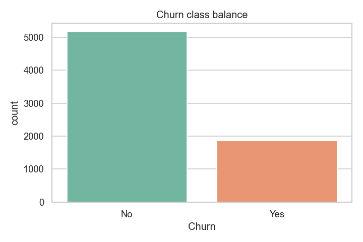
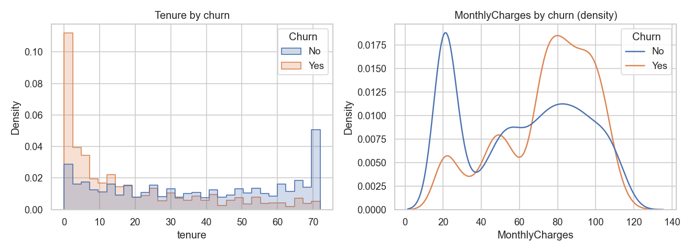
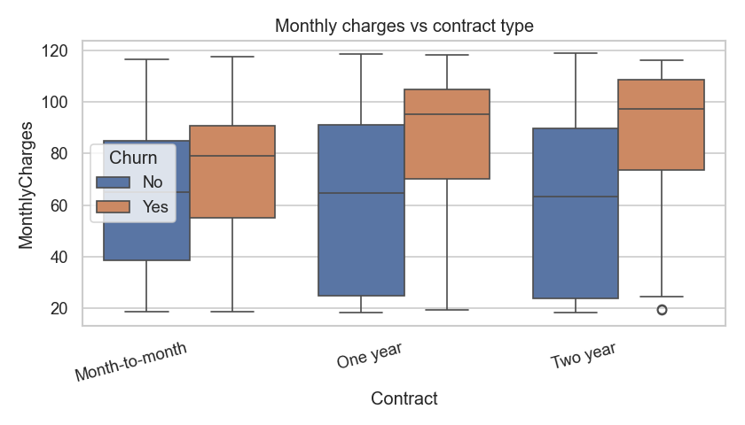
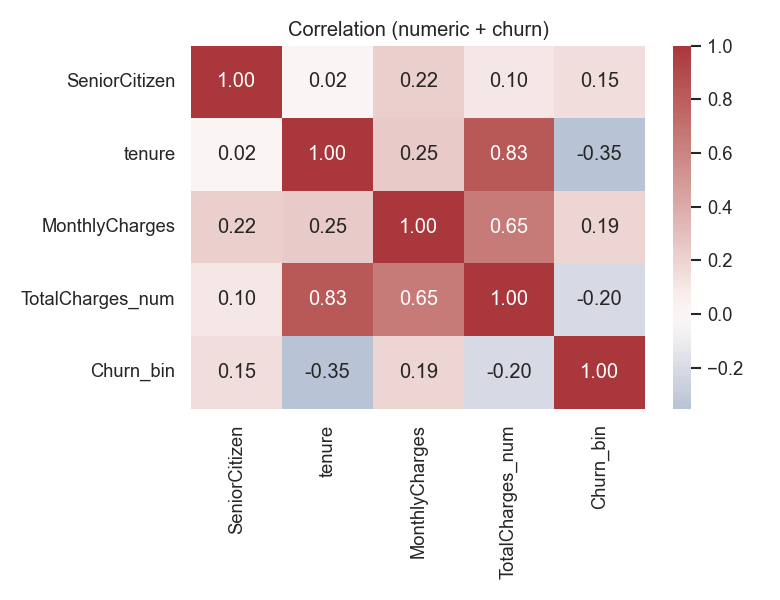
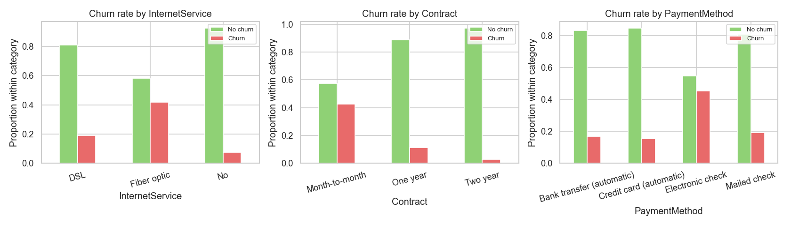

# Production Churn Prediction

End-to-end customer churn prediction on the IBM Telco dataset using XGBoost, with:
- model training + threshold tuning
- reusable sklearn pipeline artifacts
- FastAPI inference API
- optional SHAP explanations
- exploratory data analysis plots

## Features

- Feature engineering and preprocessing pipeline for Telco churn data
- XGBoost classifier with class-imbalance handling (`scale_pos_weight`)
- Optional hyperparameter search (`RandomizedSearchCV`)
- F1-optimized classification threshold
- FastAPI endpoints for health + prediction
- Optional SHAP top-feature explanations in API responses
- EDA script that exports charts to `eda_output/`

## Results (EDA Snapshots)

### Churn Class Balance



### Tenure and Monthly Charges by Churn



### Contract vs Monthly Charges



### Correlation Heatmap



### Churn Rate by Category



## Project Structure

- `train.py`: train/evaluate model and save artifacts
- `api.py`: FastAPI app for serving predictions
- `preprocess.py`: reusable preprocessing + engineered features
- `eda.py`: generates EDA summaries and plots
- `docs/images/`: README result images
- `data/Telco-Customer-Churn.csv`: input dataset
- `artifacts/`: saved model pipeline and metrics
- `pyproject.toml`: dependency + tool configuration (source of truth)

## Requirements

- Python `>=3.11,<3.15`
- Poetry (recommended)
- macOS only (sometimes): `libomp` for XGBoost native library

If needed on macOS:
```bash
brew install libomp
```

### Dependency management (Poetry)

This repository now uses Poetry as the source of truth for dependencies.

```bash
poetry install
```

If your machine has OpenMP issues loading XGBoost on macOS, install:

```bash
brew install libomp
```

### Run the project

Train model and write artifacts:

```bash
poetry run python train.py --fast
```

Generate EDA figures:

```bash
poetry run python eda.py
```

Serve API:

```bash
poetry run uvicorn api:app --host 0.0.0.0 --port 8000
```

### Lint and format (Ruff)

```bash
poetry run ruff check . --fix
poetry run ruff format .
```
